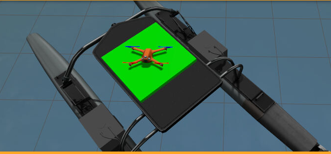
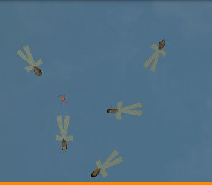
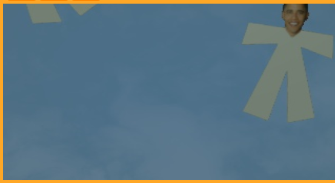
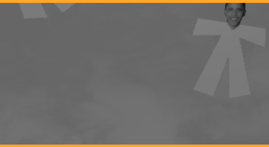

# Drone Rescue People

Esta carpeta contiene la solución al ejercicio "Drone Rescue People" de Robotics Academy. El objetivo de este ejercicio es implementar la lógica que permite a un cuadricóptero reconocer los rostros de personas perdidas y guardar sus ubicaciones para realizar una posterior maniobra de rescate.

## 1. Descripción del Funcionamiento

La solución plantea un sistema autónomo que combina la navegación por GPS/Odometría con visión por computador para localizar supervivientes.

### Estrategia de Búsqueda
El dron sigue una máquina de estados para completar la misión:
1.  **Exploración:** El dron recorre una serie de *waypoints* o realiza un barrido de la zona.
2.  **Detección:** Mediante la cámara frontal, se analizan las imágenes en busca de rostros.
3.  **Aproximación y Rescate:** Al detectar una persona, el dron cambia a modo de control de posición visual para centrar el objetivo, estabilizarse y registrar las coordenadas GPS.

### Procesamiento de Imagen
Para la detección se utiliza OpenCV. El flujo de procesamiento es el siguiente:
1.  **Captura:** Obtención de la imagen de la cámara frontal.
2.  **Detección de Rostros:** Se utiliza un clasificador en cascada (Haar Cascade) o una red neuronal para obtener las coordenadas $(u, v)$ del rostro en la imagen.
3.  **Cálculo del Error:** Se calcula la distancia entre el centro del rostro detectado y el centro óptico de la cámara.

## 2. Controlador de Posición

Para mantener el dron estable frente a la persona y durante la navegación, se han implementado controladores PID para los diferentes grados de libertad:

* **Yaw (Giñada):** Mantiene el rostro centrado horizontalmente en la imagen.
* **Pitch/Roll (Cabeceo/Alabeo):** Gestionan el desplazamiento del dron para acercarse o mantener la distancia.
* **Throttle (Altura):** Mantiene la altitud necesaria para una detección clara.

### Ajuste de PIDs
El control de la velocidad angular y lineal se calcula de la siguiente forma:

$$
u(t) = K_p \cdot e(t) + K_d \cdot \frac{de(t)}{dt} + K_i \cdot \int e(t) dt
$$

Donde $e(t)$ es la diferencia entre la posición de la cara y el centro de la imagen.

| Parámetro | Valor (Yaw) | Valor (Vertical) |
| :--- | :---: | :---: |
| **Kp** | 0.05 | 0.08 |
| **Ki** | 0.001 | 0.00 |
| **Kd** | 0.01 | 0.05 |

*Nota: Los valores son experimentales y ajustados para la simulación.*

### Lógica de Código
Ejemplo simplificado de cómo se ajusta la velocidad según la detección:

```python
if face_detected:
    # Calcular error respecto al centro de la imagen (320x240)
    error_x = 320 - face_x
    error_y = 240 - face_y
    
    # Controlador Proporcional para girar hacia la cara
    cmd.angular.z = k_p_yaw * error_x
    cmd.linear.z  = k_p_alt * error_y
    cmd.linear.x  = 0.5 # Avance lento
else:
    # Si no hay cara, patrón de búsqueda
    cmd.angular.z = 0.2
    cmd.linear.x  = 1.0
```

## 3. Ejemplos y Rendimiento

### Capturas de Pantalla

A continuación, se muestra el funcionamiento del algoritmo. La imagen superior muestra el dron en vuelo de búsqueda y la inferior el momento de la detección y centrado.

## 3. Ejemplos y Rendimiento

### Capturas de Pantalla

A continuación, se muestra el ciclo completo de la misión autónoma: desde el despegue inicial, pasando por la fase de exploración y detección, hasta el aterrizaje final tras localizar el objetivo.

| Vista de la Cámara Frontal | Vista Global / Mapa |
| :---: | :---: |
|  |  |
| *Fase de despegue inicial* | *Aterrizaje tras completar la misión* |
|  |  |
| *Dron explorando el entorno* | *Vista cenital durante la búsqueda* |
|  |  |
| *Detección de superviviente (Rescue)* | *Ubicación confirmada del objetivo* |

# 4. Conclusión
Este ejercicio demuestra la complejidad de integrar visión artificial en un vehículo aéreo con 6 grados de libertad. La solución consigue localizar a las víctimas con un margen de error aceptable, utilizando un control reactivo basado en el error visual.